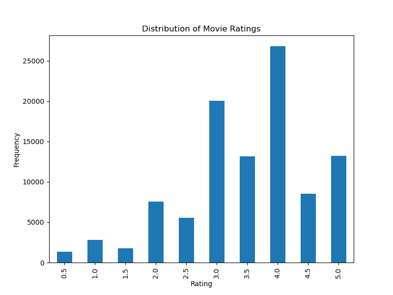
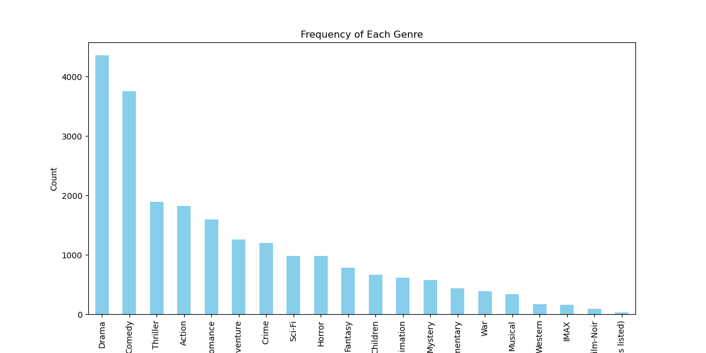
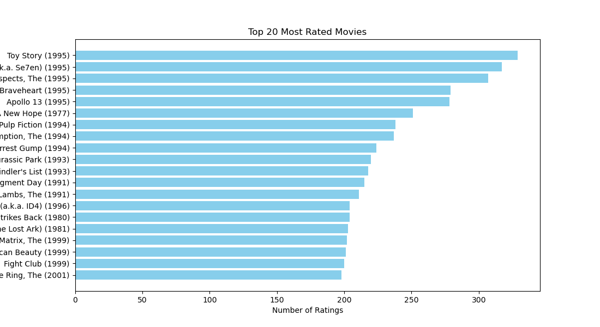

# Movie Recommendation System

This repository implements a **Movie Recommendation System** using **content-based filtering** techniques, developed with the MovieLens dataset. This document provides a structured overview of how to build, run, test, and interpret the results of the system, accompanied by visualizations and key findings.

---

## How to Build and Run the Code

### Prerequisites
1. Ensure Python 3.8 or higher is installed.
2. Clone this repository to your local machine:
   ```bash
   git clone https://github.com/jrmarble/cs506movie_rec.git
   ```
3. Install the required Python dependencies:
   ```bash
   make install
   ```

### Building the Code
The system is modularized into distinct phases: preprocessing, training, recommendation generation, and visualization. To build and prepare the system execute:

```bash
make preprocess
make train
```

This process will:

- Preprocess the MovieLens dataset, generating stratified training and testing datasets.
- Train the recommendation model and generate the content-based similarity matrix.

### Running the Recommendation System
To generate recommendations for a random user, run:

```bash
make recommend
```

The output will include:

- The user's previously rated movies and their corresponding ratings.
- A list of recommended movies with similarity scores. The similarity scores reflect how closely the recommended movie aligns with the user’s preferences, weighted by the ratings given to similar movies.
- In addition to showing up in your terminal, the random user's output and the corresponding similarity scores are stored in the "recomendations" folder.

### Generate Visuals
To generate visualizations for our data, run:

```bash
make visualize
```

---

## Test Code and GitHub Workflow

### Unit Tests
Unit tests cover key components of the system, including:

- Data preprocessing.
- Training the content-based similarity model.
- Generating recommendations.

Run the complete test suite with:

```bash
make test
```

### Continuous Integration
The repository integrates GitHub Actions for continuous integration:

- Automatically installs dependencies.
- Runs the test suite to ensure correctness and reliability of the system.

---

## Visualizations

### Insights from the Data

#### Distribution of Ratings

This graph displays the frequency of movie ratings, highlighting the general distribution of user preferences: 

#### Genre Popularity

This bar chart shows the number of movies available across various genres: 

#### User Activity

This graph showcases the top rated movies in the dataset: 


#### Inferences from Data


---

## Data Processing and Modeling

### Data Preprocessing
- Users with less than 10 films watched are removed from the dataset, ensuring our model is trained on reliable and detailed data.
- Splits the dataset into training (80%) and testing (20%) sets using stratified sampling based on movie ratings. At one point, an approach was considered where the data would be split by users. However, this is not ideal for content-based filtering and the model struggled to recommend movies when users could not be identified in the matrix.
- Creates:
  - A user-item matrix for collaborative filtering.
  - A content-based similarity matrix by combining movie genres with TF-IDF-processed tags.

### Training and Recommendation Generation

#### Content-Based Filtering:

- Uses cosine similarity between movies based on genres and tags. In effect, users will be mapped to recommended films based on their logged film's realtionships with other movies.

---

## Results

### Evaluations
- Each random query features similarity scores that range from 0 to 1. Overall, the model struggles to reach similarity scores far above .41, and seems to peak at .42 (see example below for user 476).

  !(\csv(recommendations/user_476_recommendations.csv)())

#### Similarity Matrix

A heatmap of the movie similarity matrix generated during training. This visualization demonstrates relationships between movies based on their genres and tags: 


### Key Observations
- The content-based approach recommends movies similar to those the user already enjoys.
- The lack of features such as cast, crew, studio, etc. in the MovieLens dataset (we are restricted to info on genre and rating) is restrictive for building a predictive model. A model using a database with more features could be more sophisticated and provide recommendations with greater similarity. 
- Sparse user-item interactions occasionally limit the model’s ability to provide novel recommendations. Users with a greater number of logged films have recommendations with noticably more larger and unique similarity scores, whereas a user with only 10 logged films may have a less sophisticed output of films all featuring identical scores.

---

## Conclusion

This Movie Recommendation System successfully combines content-based filtering techniques on genre and quality to deliver user-specific movie recommendations.

### Future Directions
Potential enhancements include:

- Exploring hybrid models, such as integrating a collaborative-based approach to balance recommendation diversity and relevance.
- Using a more detailed dataset with better features to increase accuracy.

The system demonstrates consistent classification results and provides a strong foundation for further improvement in similar recommendation systems.
